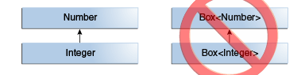
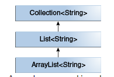

# 제네릭


## 제네릭 프로그래밍이란? 

> 내가 그의 이름을 불러주기 전에는
그는 다만
하나의 몸짓에 지나지 않았다.

> 내가 그의 이름을 불러주었을 때,
그는 나에게로 와서
꽃이 되었다.

 
## 왜 제네릭?

```java
    List list = new ArrayList();
    list.add("hello");
    String s = (String) list.get(0);

    List<String> list = new ArrayList<String>();
    list.add("hello");
    String s = list.get(0);   // no cast
```

## *generic is compile time thing!*

```java
public class Node<T> {

    private T data;
    private Node<T> next;

    public Node(T data, Node<T> next) {
        this.data = data;
        this.next = next;
    }

    public T getData() { return data; }
    // ...
}
```

```java
public class Node {

    private Object data;
    private Node next;

    public Node(Object data, Node next) {
        this.data = data;
        this.next = next;
    }

    public Object getData() { return data; }
    // ...
}
```

## 상속 관계




## SubType?

<details>
    <summary>
    리스코프 치환 법칙
</summary>
    모든 프로그램 P에서 
X1의 클래스의 인스턴스가 수행하는 기능을 
X2 클래스 인스턴스로 변경했을 때 
똑같이 동작하면 X2는 X1의 subtype이다.  
</details>


## WildCard?

? => 뭔지 모르겠지만... 

Box<?> => 뭐가 닮겨있는지 모르는 박스

Box<? extends Cat>

뭔지 모르겠지만 고양이 subtype이 닮긴 박스

Box<? super AfricaLion>

뭔지 모르겠지만 subtype이 africaLion인 superType이 닮긴 박스

PECS

producer extends , consumer super